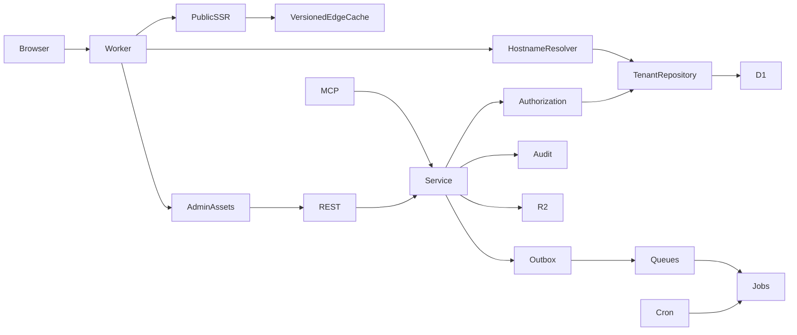

# Kiến trúc Penlum

## Request flow

Control routes `/admin`, `/api`, `/mcp` chỉ phục vụ trên `ADMIN_HOST`. Không dùng Host, forwarded headers hoặc site_id từ client để bỏ qua authorization. Public chỉ resolve domain verified và site active. Primary domain không đổi qua PATCH; chuyển primary cần migration/domain policy riêng.

D1 composite primary/foreign keys ngăn category/post links chéo tenant. Mọi endpoint tenant kiểm tra scope và membership trước đọc/ghi. API site/service key chỉ truy cập site được bind. System key được cấp scope cụ thể; `system:admin` mở quyền hệ thống. Author chỉ đọc/sửa chính bài của mình, không publish.

## Transaction và concurrency

Post/site/snippet updates dùng version. D1 batch chứa UPDATE, assertion `changes()=1` qua CHECK constraint, audit và cache-version update; stale writes rollback cả batch. Relation và link-graph changes cùng batch với post write. API credential chỉ xuất secret một lần, audit không chứa secret/password.

REST client nên gửi `Idempotency-Key` cho create/publish/bulk. Key bind actor + method/path/body hash, lưu 24 giờ. Request đang chạy hoặc crash sau mutation trước khi lưu response giữ trạng thái “in progress”: client cần kiểm tra tài nguyên/audit thay vì tự lặp bằng key mới. Đây là at-most-one admission + replay, không tuyên bố exactly-once qua network failures. MCP gọi cùng service; các thao tác nguy hiểm bulk publish/delete-site/global code không được expose.

Queue delivery là at-least-once. Jobs completed được bỏ qua; GSC upsert và export key deterministic; audit rerun resolve kết quả cũ. Queued jobs được Cron gửi lại khi Queue send lỗi. Job failed có retry, DLQ và API retry thủ công. Một số job có thể chạy trùng khi retry/race; dùng idempotent destination writes, chưa có distributed lease.

## Cache

Cache key: `hostname / site_id / site.cache_version / global_cache_version / pathname`.

Mỗi request đọc tenant/version từ D1 trước khi đọc Cache API. Mọi mutation ảnh hưởng public bump riêng site; global code mới bump global generation. Vì V1 mỗi site khoảng 20–25 bài, hiện invalidate cả site bằng generation, không physical purge từng URL. Site A đổi không thay cache-version site B. Nội dung HTTP trả browser `max-age=0`; Cache API giữ 300 giây để entry phiên bản cũ tự hết hạn. Media kiểm tra tenant/site trước lấy R2; browser cache media 300 giây.

Admin/API/preview no-store + noindex. Draft và scheduled không xuất public. Site staging/archive trả 404; preview của người được cấp quyền vẫn xem được. Alias có thể 301 về primary, hoặc SSR với canonical primary khi cấu hình tắt redirect.

## Content, SEO và CSP

Markdown → marked → sanitize-html → heading IDs → internal link extraction → SSR. HTML người viết bị escape; script không chạy trong Markdown. Template tạo H1; nội dung dùng H2–H6. SVG upload không cho phép. R2 chấp nhận PNG/JPEG/GIF, kiểm tra signature, MIME, kích thước, số byte; giới hạn 10 MB. Không có image optimizer WebP/AVIF tự động ở bản này.

Code không executable được sanitize. Executable site/global code chỉ super admin; global cần xác nhận `APPLY GLOBAL CODE` và lưu revision. CSP chỉ cho inline scripts có SHA-256 hash, không external scripts, eval, iframe hoặc outbound fetch. Analytics scripts bên ngoài cần thiết kế allowlist CSP trước khi hỗ trợ. JSON-LD không sinh rating, credentials hay Organization/Person giả; schema overrides chỉ about/keywords.

Session: random token 72 ký tự, DB chỉ giữ hash, thời hạn 8 giờ. Production cookie `__Host-penlum; Secure; HttpOnly; SameSite=Strict`; mutation bắt buộc Origin cùng admin origin. Local cookie không Secure vì HTTP. PBKDF2-SHA256 100.000 iterations (giới hạn Web Crypto của Workers cần đo CPU thực tế). Rate limiting dùng D1 window một phút, chưa phải lựa chọn cuối cho rollout 1.000 sites.

## Nâng cấp data layer

V1 một D1 shared schema. `Database` / `TenantRepository` tập trung tenant reads và cache generation. Services hiện có D1 prepared-write batches để bảo đảm mutation+audit atomic. Chưa có shard router hoạt động. Khi cần shard: tách directory/auth/global code khỏi tenant data, chuyển write batches thành repository commands, route tenant repositories qua directory mapping và replicate membership/auth metadata có version. Không thay public hostname/API contracts. Không quảng bá source hiện tại là có thể thêm shard chỉ bằng đổi binding.
